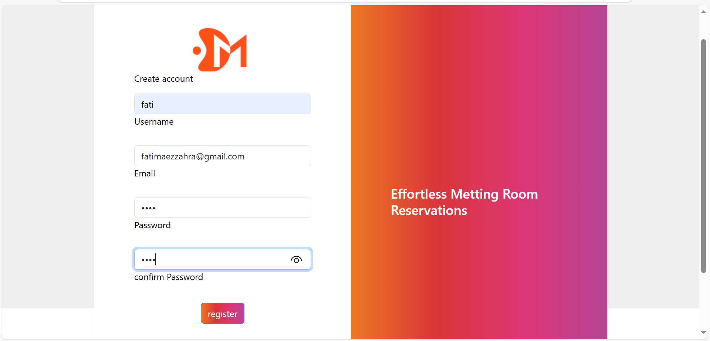
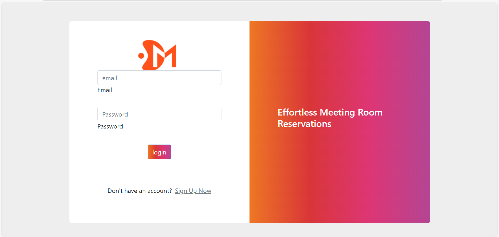

<h2>✨ Interface utilisateur</h2>

  

<b>Page d’accueil</b> — Navigation simple et claire

  

<b>Inscription </b> — Validation + feedback utilisateur

  

<b>Connexion</b> — Sélection du rôle et sécurité

